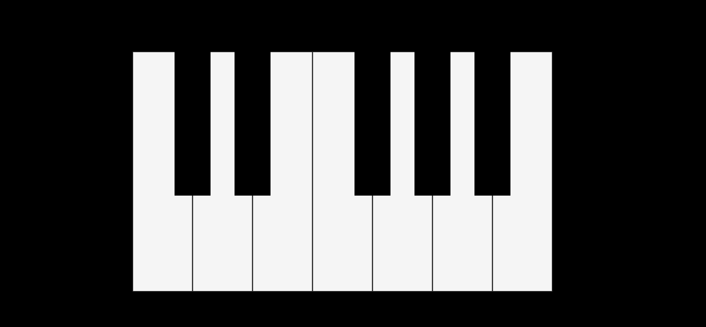

# Digital-Piano

## Introduction
Simple piano that can be played using the mouse or keyboard. 

You can visit: https://lilliana1.github.io/digital-piano/
How to play using keyboard? 
| Piano notes  | Keyboard       |       
| ---          |            --- |
| C            | z              | 
| C#           | s              | 
| D            | x              | 
| D#           | d              | 
| E            | c              | 
| F            | v              |
| F#           | g              | 
| G            | b              | 
| G#           | h              | 
| A            | n              | 
| A#           | j              | 
| B            | m              | 

* not playing when pressing keyboard?
check is not upper-case

## Technologies
* HTML
* CSS
* JS

## Instalation
1. On GitHub, navigate to the main page of the repository.
2. Under the repository name, click Clone or download.
3. To clone the repository, click "Clone with HTTPS".
4. Open Terminal.
5. Change the current working directory to the location where you want the cloned directory to be made.
6. Type git clone, and then paste the URL you copied in Step 2.
7. Press Enter. Your local clone will be created.

## Authors
* Lilliana Ramos